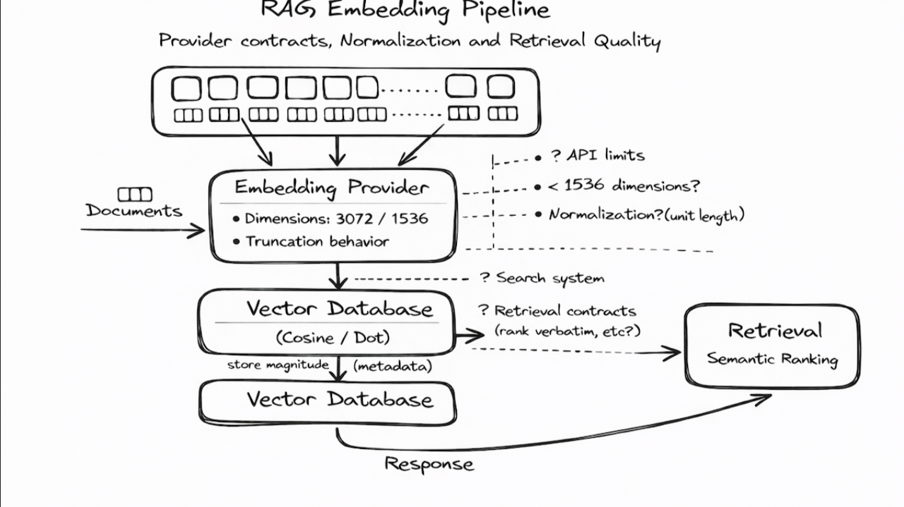

# RAG with Gemini Embeddings: What Changes When You Move Beyond OpenAI



When adding Gemini embeddings to an existing OpenAI based RAG pipeline, three practical differences surfaced quickly: truncated embedding dimensions, stricter rate limits, and the need to be explicit about vector normalization to preserve retrieval quality.

I initially expected a straightforward provider swap. Instead, these differences showed up not as hard failures, but as small degradations in search relevance - which are often the hardest issues to diagnose.

## TL;DR

This article documents what changed when adding Gemini embeddings to an existing RAG pipeline: how truncated dimensions affect normalization, how Gemini's task_type introduces asymmetric document/query embeddings, and how provider-specific limits (batching, truncation) influence retrieval quality. It focuses on practical adjustments—normalization, ingestion choices, and explicit contracts—that helped stabilize retrieval behavior in a multi-provider setup.

## The Migration Context

With OpenAI embeddings, the system relied on a few explicit guarantees provided by the platform:

* Fixed embedding dimensions
* Pre-normalized vectors
* Support for large embedding batches
* Clear, hard errors when limits were exceeded

Gemini operates with smaller batch sizes and tighter token limits, and some behaviors, such as input truncation, are handled differently. The pipeline still worked end-to-end, but retrieval quality became slightly inconsistent. That's often a signal that something mathematical, not semantic, has shifted.

## Truncated Dimensions Change Vector Behavior (not usefulness)

Gemini’s default embedding size is 3072 dimensions, but it also supports smaller outputs like 1536 and 768 via truncation. In my RAG implementation, I chose 1536 dimensions as the default.

In practice, 1536 provides a strong balance for most general-purpose RAG workloads:

* solid semantic coverage for document retrieval
* meaningfully lower storage and memory footprint
* faster similarity computation at scale

While the full 3072-dimension embeddings can be useful for very domain-specific or highly nuanced corpora, they also increase storage and compute costs. For many RAG systems, those additional costs don’t translate into proportionate gains in retrieval quality.

Gemini uses Matryoshka Representation Learning (MRL) to normalize the full 3072-dimension embedding; smaller truncated embedding vectors retain meaning but not unit magnitude - meaning their vector length can influence ranking unless explicitly normalized.

At this point, it’s natural to ask why not just use dot product instead of cosine similarity.

The distinction isn’t the math primitive - it’s whether vectors are normalized. When vectors are unit-normalized, dot product and cosine similarity are mathematically equivalent, and many vector databases use dot product internally purely for performance reasons.

The difference only matters when vectors are not normalized. In that case, dot product blends direction and magnitude into a single score. That can be useful when magnitude is an intentional signal, but in RAG, magnitude differences introduced by truncation are artifacts- not meaning.

Nothing crashes. Results just get slightly worse.

The takeaway isn’t to avoid truncated dimensions. It’s to treat normalization as part of the embedding contract when using them.

## Solving the Normalization Gap in RAG

Choosing 1536 (or 768) dimensions introduces a clear requirement: explicit normalization.

Normalization scales a vector to unit length so retrieval focuses on semantic direction rather than vector magnitude. While the full 3072-dimension Gemini embedding is pre-normalized, truncated embeddings are not. If unnormalized vectors are stored, retrieval can drift toward chunks with larger vector magnitude rather than closer semantic meaning.

### Implementation: Automated vs Manual Normalization

There are two practical ways to address this:

### Option 1: Let the Vector Database Handle It

In my stack, I use Qdrant. By configuring the collection with distance=Cosine, normalization is handled automatically at ingestion.

* Unnormalized vectors are scaled to unit length
* Matching uses high-speed dot product under the hood
* Results are mathematically equivalent to cosine similarity

A quick test confirmed this behavior: a raw 1536-dim Gemini embedding with an L2 norm of ~0.69 was returned from Qdrant with a norm of exactly 1.0—closing a ~30% magnitude gap that would have otherwise skewed retrieval.


**TESTING QDRANT AUTOMATIC NORMALIZATION**

Raw embedding L2 norm: 0.691057
Raw embedding (first 8 values): [-0.0297, 0.017206, -0.000331, -0.075324, -1.5e-05, 0.008705, -0.016225, 0.016641]

Inserted raw embedding into Qdrant (point ID: 999999)

Retrieved embedding L2 norm: 1.000000
Retrieved embedding (first 8 values): [-0.042978, 0.024898, -0.000479, -0.108998, -2.1e-05, 0.012597, -0.023478, 0.02408]

Norm difference: 0.3089432382

### Option 2: Manual normalization prior to creating chunks in the vector database

If your vector database requires pre-normalized data, normalization must be handled explicitly before upsert. A simple L2 normalization step in the ingestion path is sufficient and keeps the pipeline portable.

### Primary: Primary (NumPy Version)

```python
import os
import numpy as np
from google import genai

# Expect GEMINI_API_KEY to be set in the environment
api_key = os.getenv("GEMINI_API_KEY")
client = genai.Client(api_key=api_key)

texts = [
    "RAG systems combine retrieval with generation",
    "Gemini embeddings support multiple output dimensions",
    "Normalization matters for cosine similarity",
]

response = client.models.embed_content(
    model="models/gemini-embedding-001",
    contents=texts,
    config=genai.types.EmbedContentConfig(
        output_dimensionality=1536,
        task_type="RETRIEVAL_DOCUMENT",
    ),
)

def l2_normalize_np(vec):
    v = np.asarray(vec, dtype=np.float32)
    norm = np.linalg.norm(v)
    return (v / norm).tolist() if norm > 0 else vec

embeddings = [l2_normalize_np(e.values) for e in response.embeddings]

# Sanity check
norm = np.linalg.norm(np.asarray(embeddings[0]))
print(f"L2 norm: {norm:.6f}")
```

### Fallback: Pure-python code for L2-Norm reference code

For lightweight or single-vector paths, a simple pure-Python L2 normalization function is sufficient and avoids unnecessary dependencies.

```python
import math

def l2_normalize(vec):
    mag = math.sqrt(sum(x * x for x in vec))
    return [x / mag for x in vec] if mag > 0 else vec
```

## API Rate Limits to Watch Across Providers

When working with multiple embedding providers, API constraints quietly shape ingestion behavior.

In my setup, the key differences showed up around batching, input length, and failure mode. Here, batch size refers to the number of input strings per embedding request, not a batch file or dataset size.

With Gemini embeddings, inputs beyond ~2,048 tokens per string may be silently truncated by default, whereas other providers typically surface this as a hard error. That difference is easy to miss and can result in embedding partial documents without realizing it.

To stay well within limits, I configured ingestion with smaller batches of input strings (on the order of a few dozen per request - embedding_batch_size=35 - in my case,  and chunk sizes around 500 tokens per string. These values weren’t recommendations—they were derived from provider constraints and from how the underlying documents were structured and chunked semantically.

One important guardrail was disabling silent truncation for Gemini (autoTruncate=false), so over-length inputs fail loudly instead of quietly dropping content. The takeaway isn’t the specific numbers—it’s making batching, chunking, and truncation behavior part of the embedding contract, not an implicit assumption.

## Query vs. Corpus Embeddings: A Gemini-Specific Contract

While vector databases control the mechanics of search, Gemini also exposes embedding-level knobs—such as task_type—that influence retrieval behavior by shaping how document and query vectors are generated. This distinction does not exist in OpenAI embeddings and is an important part of Gemini’s provider contract.

A common mistake when migrating to Gemini is treating embeddings as symmetric—using the same embedding logic for both corpus ingestion and user queries. Gemini, however, operates on an asymmetric contract.

In practice, leaving task_type unspecified behaves the same as using RETRIEVAL_QUERY. If defaults are used during ingestion, reference documents are embedded as if they were search queries. This mismatch can quietly reduce retrieval precision, because documents are not projected into the vector space intended for “sources of truth.”

To avoid this, in my implementation, I moved away from defaults and made roles explicit for my document search use case:

### Ingestion (Corpus): RETRIEVAL_DOCUMENT

Embeds documents as authoritative sources, optimized to be retrieved.

### Retrieval (User Query): QUESTION_ANSWERING

Embeds queries as answer-seeking prompts, aligning better with factual passages in RAG workflows. In my use case (my corpus and user prompts in a query format) QUESTION_ANSWERING worked well. RETRIEVAL_QUERY performed better marginally, although with higher top-k.

### Insight: Explicitly separating these roles helps bridge the semantic gap between how users ask questions and how technical documents are written. It’s the difference between retrieving something that looks similar to the query and retrieving something that actually answers it.

## Observed Effects from a Controlled Test

To validate Gemini’s embedding behavior beyond documentation, I ran a small controlled test using truncated (1536-dim) embeddings across document ingestion and query retrieval. A few patterns stood out:

* **Default vs. RETRIEVAL_QUERY**: No measurable difference in query embeddings (Δ ≈ 0.000), indicating equivalent behavior. Confirms RETRIEVAL_QUERY is the default
* **RETRIEVAL_DOCUMENT vs. default**: A clear vector shift for corpus embeddings (Δ ≈ 0.072), confirming intentional asymmetry between document and query spaces.
* **QUESTION_ANSWERING vs. default**: A smaller but real query shift (Δ ≈ 0.010), showing additional shaping for answer-focused retrieval.
* **Normalization**: All truncated embeddings returned with magnitudes around 0.69–0.70, regardless of task type.

Retrieval rankings remained stable in a small test, reinforcing that these differences surface as gradual relevance drift, not hard failures.

## Lessons Learned

1. **Infrastructure as a Safety Net**: A modern vector database can prevent silent accuracy degradation by enforcing correct similarity semantics and by making index/query assumptions explicit. Subtle mismatches between how document vectors are indexed and how query vectors are produced can quietly erode retrieval quality.

2. **Trust, but Verify**: Truncated embeddings don’t lose meaning - but they do lose unit scale. Always inspect L2 norms when changing embedding dimensions, and verify that both document and query vectors occupy the same normalized space. Asymmetry here leads to biased ranking, even when cosine similarity is used.

3. **Magnitude is Metadata (The “Confidence” Signal)**: While normalization is essential for retrieval, the original magnitude can be stored as metadata. It often acts as a useful proxy for model confidence or semantic intensity.

   This becomes especially valuable when document embeddings and query embeddings exhibit different magnitude distributions, which is common across providers and truncation settings.

4. **Standardize Your Pipeline**: Even if the database auto-normalizes, implementing normalization explicitly in code improves portability, testability, and future migrations.

   Critically, apply the same normalization and preprocessing rules to both the document index vector space and the search query vector space. RAG failures often stem not from bad models, but from asymmetric pipelines.

## Final Takeaway

Supporting multiple embedding providers isn’t just about swapping API keys—it’s about understanding the unique "contracts" each provider exposes. Embedding dimensions, embedding space, normalization guarantees, and rate limits differ meaningfully between OpenAI and Gemini, and these differences only surface once systems reach production scale.

This journey reflected the necessity of making these contracts explicit. By understanding how vector databases handle these nuances and intentionally shaping our vectors through task_type and normalization, we ensure that RAG behavior remains consistent, reliable, and—most importantly—accurate.


